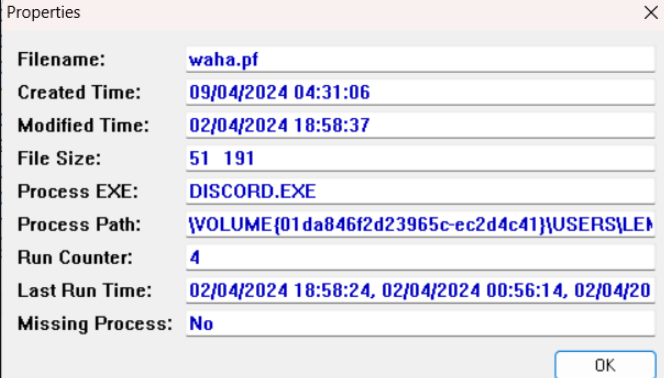
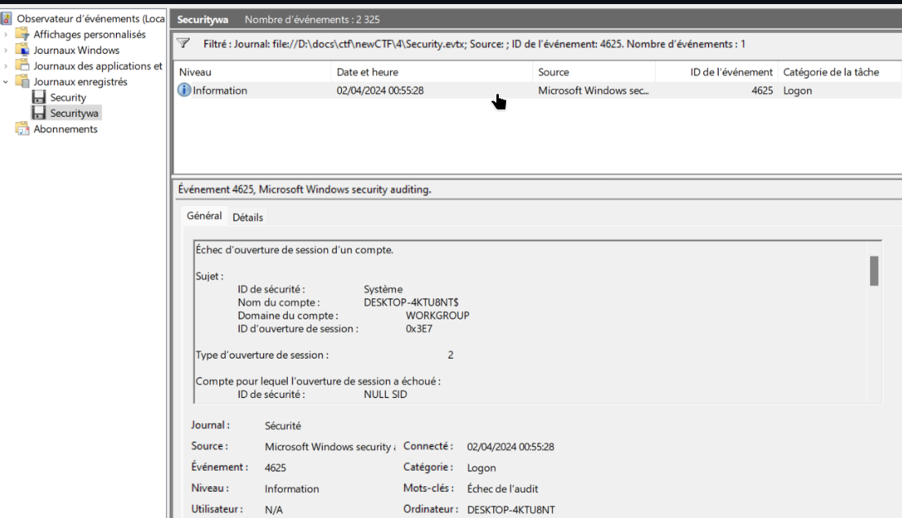
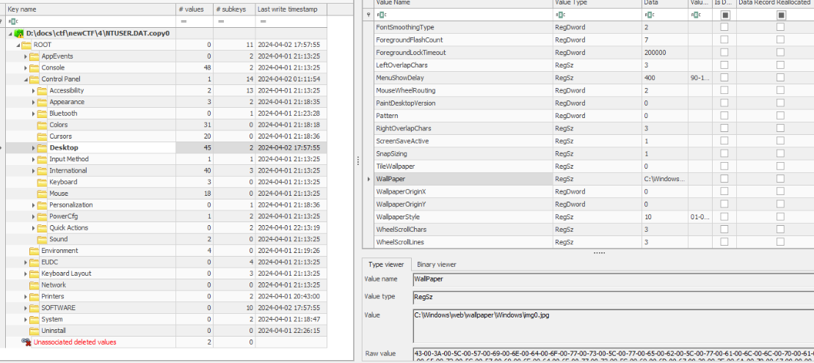
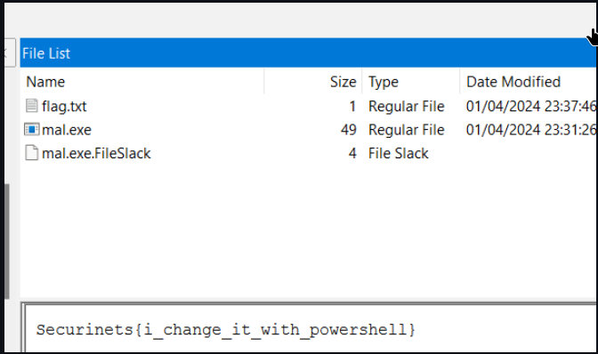
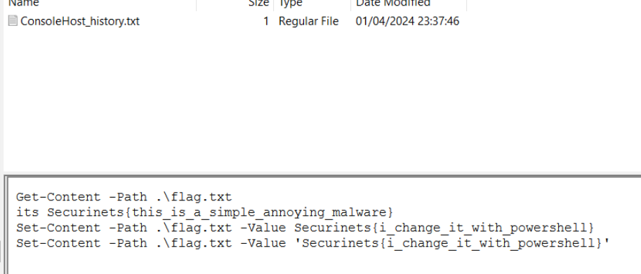

# description

We've uncovered a suspicious disk image from a lem3alem PC, and we need your help to investigate! Your task is to analyze the image and answer a few basic questions about the system and to find the malware in the PC.

# file
https://drive.google.com/file/d/15kSx-CfI4ejc79iCyA3ASoyOL_jYsXtv/view?usp=sharing

## solver

1-what is the computer bame ? 
DESKTOP-4KTU8NT

2-identify the OS build number ?
19045

3-how many time the user open discord.exe ?  from prefetch folder
 
4

4-time of the last run of discord.exe ? UTC+1 yyyy-mm-dd hh:mm:ss (you can find the answer in the prev pic)
2024-04-02 18:58:24

5-at what time in UTC+1 a faild login attempt occur? yyyy-mm-dd hh:mm:ss
 
2024-04-01 00:55:28

6-what is the full path of the image used as a wallpaper ? (you can find it the Windows user profile registry hive)
 
PATH=`NTUSER.DAT/Control Panel/Desktop`
  
C:\Windows\web\wallpaper\Windows\img0.jpg

7-what is the first name of the oldest cousin of lem3alem ?   (this is a security question) use this tool https://www.nirsoft.net/utils/security_questions_view.html  
fedi

8-What is the MD5 of the suspicious executable found on this machine? 
8e5bc116e976539d57087472043aa475

9-what is the original flag found in flag.txt?  

Securinets{this_is_a_simple_annoying_malware}
So from here we can see that the user change this file with powershell So we can see the content of APPDATA\Microsoft\Windows\PowerShell\PSReadLine\ConsoleHost_history.txt to see powershell hisory

10-how long did it take for the ZIP file to be downloaded from Discord? (ms)  (in the History file of Chrome)
9572.707

