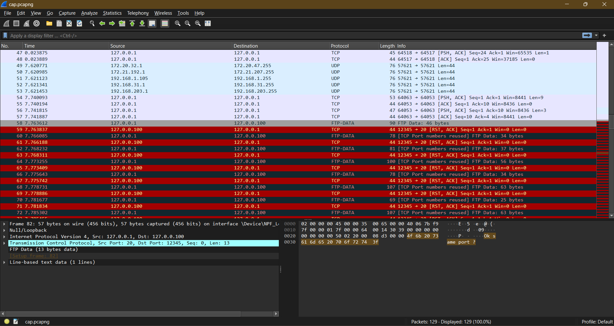
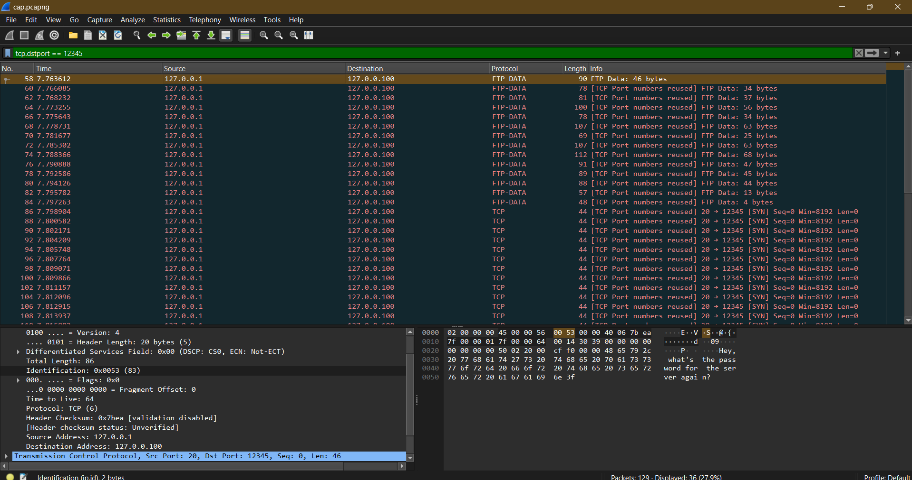

#   IP fields?  406 - Malware Analysis Writeup

## Challenge Descritption


My friend here is trying to send me the server's password but I'm failing to understand him. I think there's something weird about the ID field btw. Can you help?

---

## Provided Files

[capture file](taskFiles/cap.pcapng)

---

## TL;DR

The flag is converted to ascii code, and each code is sent via the IP ID field of the packet. [Here's the python solver.](solver/solver.py)

**Flag: Securinets{Sens1t1ve_d4t4_0ver_IP??}**

---

## Initial Analysis

For this challenge, the players were given a .pacapng file. Oppening with wireshark will reveal a bunch of TCP streams followed by multiple corrupted ones.



As a first step, we analyse the TCP streams with the follow TCP stream option on wireshark. The first useful stream is the third one


Following the next streams reveals a convesation about sending the office server's password securely and hintng to the IP fields section.

```
Hey, what's the password for the server again?

Not something I can just say here.

You can send it in a safe way, right?

I’ve got a way, but you need to think outside the box.

Outside the box? What do you mean?

Just look closely. Sometimes, things aren't where you'd expect.

Hmm, that sounds cryptic.

Let's just say, the important info isn't always in plain sight.

Okay, I'll figure it out... Should I be checking somewhere specific?

The Ip packets got different fields don't they?

Bro you know I'm not that good in networking.

Just take a look at the fields you'll get it

Ok same port?

Yes.
```

This conversation goes on until stream 15, and from there on, the TCP streams are empty.

The conversation hinted at IP fields, the task description said the ID field was weird, and we should only look at one port. Well, those are enough hints.

Looking at the first packet sent, we find out that the port was 12345. Let's start by filtering them out.



Well that's less packets for now to analyse. When analysing the ID field of the IP header, the first thing that comes to mind is to actually look for their usage in general. *The IP-ID field identifies uniquely fragments of the packets and it is used to handle the re-assembling process.*

In many systems, the IP ID field is incremented sequentially for each outgoing packet. Yet these IDs have no obvious relationship between one another. Let's extract them for now using a simple python script.

```py
from scapy.all import rdpcap, IP, TCP

def extract_ID(pcap_file):
    packets = rdpcap(pcap_file)
    flag = ""

    for packet in packets:
        if packet.haslayer(IP) and packet.haslayer(TCP):
            if packet[TCP].dport == 12345:
                ip_id = packet[IP].id
                flag += str(ip_id) + " "

    print(f"Extracted IDs: {flag}")

pcap_file = "cap.pcapng"

extract_ID(pcap_file)
```

```bash
Extracted IDs: 83 101 99 117 114 105 110 101 116 115 123 83 101 110 115 49 116 49 118 101 95 100 52 116 52 95 48 118 101 114 95 73 80 63 63 125
```

Well looks familiar doesn't it? You should realize by now that this is our flag encrypted and this looks like ascii, so a quick update to our python script by changing it to print the corresponding ascii character instead of number should do the trick.

```py
flag += str(chr(ip_id))
```

```bash
Extracted flag: Securinets{Sens1t1ve_d4t4_0ver_IP??}
```

**Flag: Securinets{Sens1t1ve_d4t4_0ver_IP??}**
