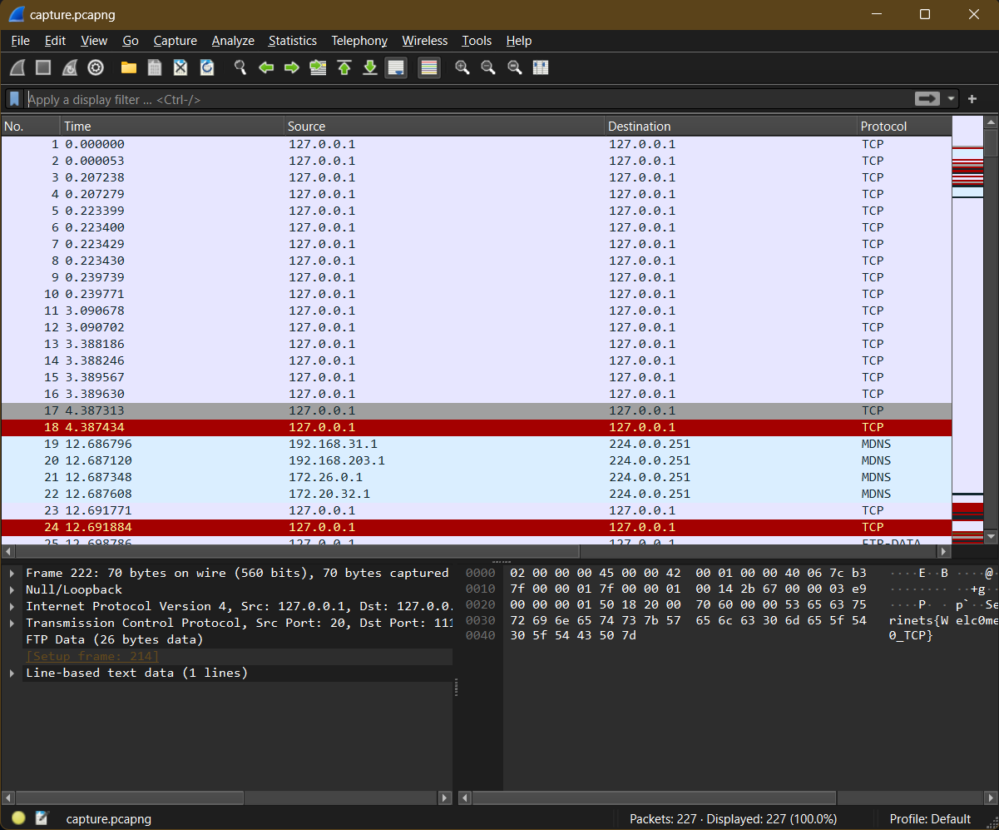
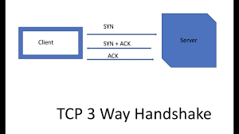
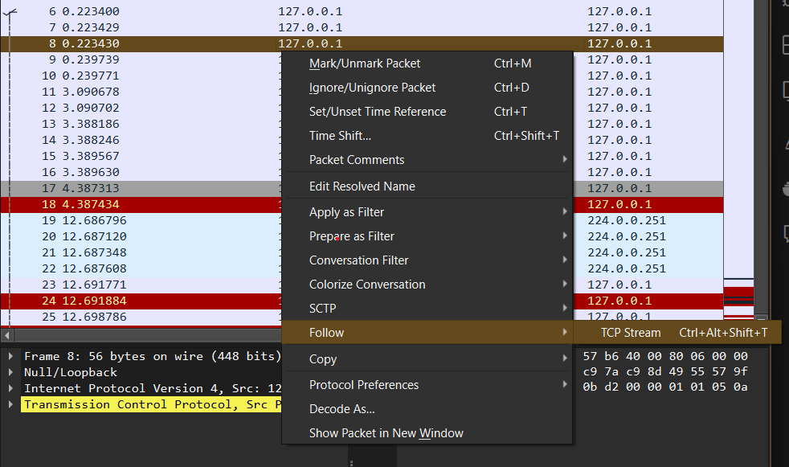
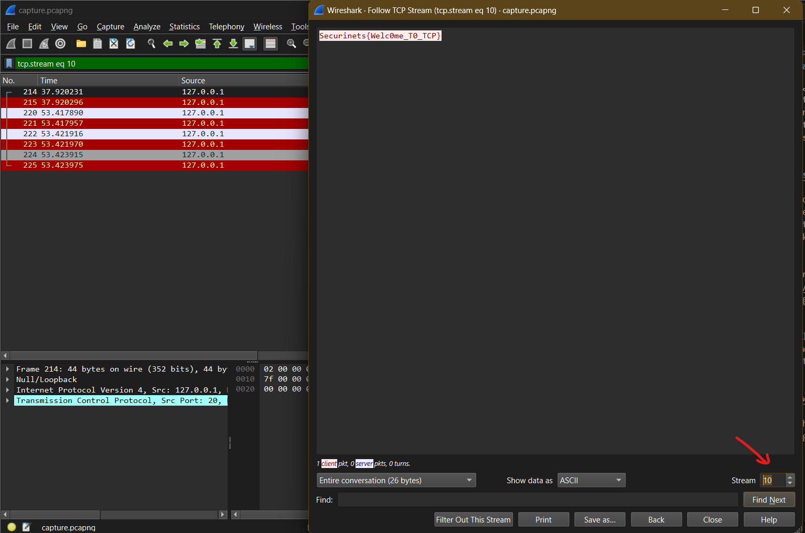

# Welcome to Wireshark 66 - Forensics Writeup

## Challenge Description

We believe someone is using TCP to communicate sensitive information to outsiders. Can you find the data?

---

## Provided Files

[capture file](taskFiles/capture.pcapng)

---

## TL;DR

Open the file using **Wireshark** and follow the TCP streams until you find the flag in TCP stream 10.

**Flag: Securinets{Welc0me_T0_TCP}**

---

## Analysis

This task is designed for total beginners to introduce them to Wireshark. First, you have to download it. Just follow [this link](https://www.wireshark.org/download.html) and select the version that suits your system.

Once you install it and open the capture file, you'll see a large number of **packets**. In a nutshell, packets are units of data formatted to be sent over the network. Various protocols are used for formatting them. For this task, we will focus on TCP.

To understand TCP for this challenge, you just need to know about the TCP handshake. In short, before sending data, the client must initiate a connection with the server. This is done using different types of TCP packets, as shown below.

After initiating the connection, the client sends data split into multiple packets. These packets form the TCP stream, and with each packet received, the server sends a response packet to acknowledge that the previous one was received.

If you'd like to read more about TCP, I recommend [this article](https://3hcloud.com/blog/technologies/tcp-ip-protocol-stack-guide-for-beginners-basics-layer-model/).

To solve this challenge, Wireshark provides a feature to follow these streams. Right-click on any TCP packet, select "Follow," and then click "TCP Stream."

Next, keep navigating through the streams using the arrow on the bottom right until you reach stream 10.

**Flag: Securinets{Welc0me_T0_TCP}**
