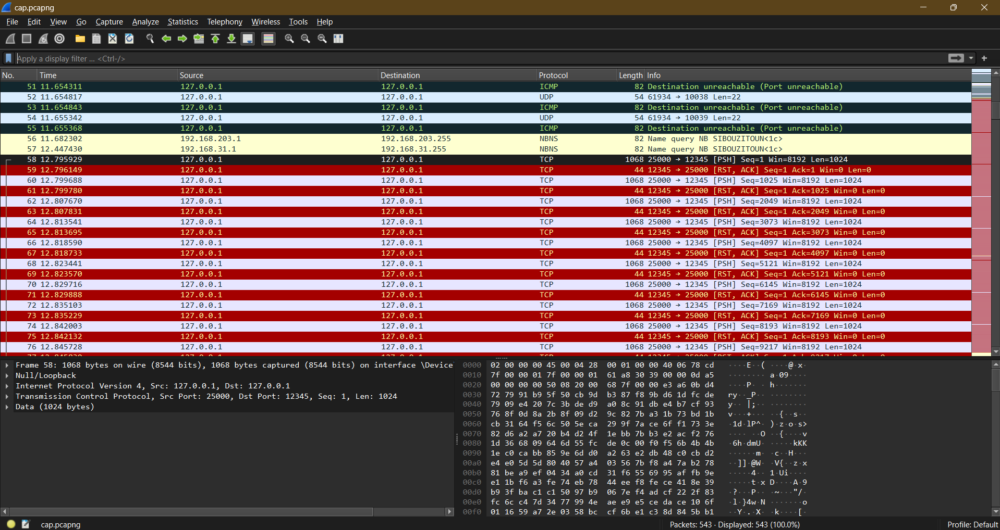

#   random puzzle  433 - Malware Analysis Writeup

## Challenge Descritption


Someone hacked into our servers and stole a critical piece of information. we got the script he used to get the data but we still cant find what he stole.

Hints:
- the shuffling is reversible. You just need to find the seed in the packets file.

---

## Provided Files

[capture file](taskFiles/cap.pcapng)
[shuffling script](taskFiles/send.py)

---

## TL;DR

You just need to extract the packets sent to the port specified in the shuffling script. The seed is the epoch arrival time of the first packet. Here's a [python solver](solver/solver.py).

**Flag: Securinets{W0w_Tcp_1S_crazy}**

---

## Initial Analysis

For this task, the player is given a capture file and the script used to transmit the packets. Opening the capture file with wireshark wont reveal much except a long tcp stream.



Let's start by analysing the python code.

```py
from scapy.all import *
import time
from math import floor

# Define the target IP and port
target_ip = "127.0.0.1"
target_port = 12345

# Path to the image file
image_path = "flag.png"

# Create the TCP connection (just send the data without handshaking)
src_port = 25000
```

Reading the first few lines reveal that this script is sending a png over TCP to the localhost address from port 25000 to port 12345.

```py
# Use the current time as a random seed
random.seed(floor(time.time()))


# Read the image file and split it into chunks
chunk_size = 1024  # Fixed chunk size
chunks = []

with open(image_path, "rb") as img_file:
    while True:
        data_chunk = img_file.read(chunk_size)
        if not data_chunk:
            break
        chunks.append(data_chunk)

# Randomize the order of the chunks
random.shuffle(chunks)
```

It then sets the seed as the return value of time.time() floored using the math.floor() function. This function returns the local time in linux epoch format.

> Unix time is a date and time representation widely used in computing. It measures time by the number of non-leap seconds that have elapsed since 00:00:00 UTC on 1 January 1970, the Unix epoch. In modern computing, values are sometimes stored with higher granularity, such as microseconds or nanoseconds. 

Let's get the seed for now. Logically, the time captured when the script was executed will approximatly be the arrival time of the first packet sent. so let's filter out the packets sent from port 25000 to port 12345 and analyse the first one.


looking at the **Epoch Arrival Time** we find our seed to be the floor value of 1727768037.212800000 so **1727768037**.

```py
# Send the randomized chunks over TCP
seq_num = random.randint(0, 10000)  # Random initial sequence number
for data_chunk in chunks:
    packet = IP(dst=target_ip) / TCP(sport=src_port, dport=target_port, flags='P', seq=seq_num) / Raw(load=data_chunk)
    send(packet)
    seq_num += len(data_chunk)  # Update sequence number for each chunk

print("Image sent successfully in randomized order!")
```

The rest of the script will be used to set a random sequence number and take care of the sending process. So it's not so relevant to our task.

What we need to do now is to extract the data from the packets and reverse the shuffling. This python script shoul do the trick.

```py
from scapy.all import *

def extract_reordered_png(pcap_file, port, output_file):
    packets = rdpcap(pcap_file)

    packet_data = []

    random.seed(1727768037)
    for packet in packets:
        if TCP in packet and packet[TCP].dport == port:
            payload = bytes(packet[TCP].payload)
            if payload:
               packet_data.append(payload)
    print(len(packet_data))
    t = list(range(len(packet_data)))
    random.shuffle(t)

    final = [0] * len(packet_data)

    for i in range(len(packet_data)):
        final[t[i]] = packet_data[i]

    png_data = b''.join(final)

    with open(output_file, 'wb') as f:
        f.write(png_data)

    print(f"PNG file successfully reconstructed and saved as {output_file}")

pcap_file = 'cap.pcapng'
output_file = 'reconstructed_image.png'
port = 12345

extract_reordered_png(pcap_file, port, output_file)
```

To understand the deshuffling logic, let me explain how shuffle works. Any randomization script out there is using a seed to generate the "random" outcome. The seed in a nutshell is the value used by this algorithm to calculate the random value. suppose the randomization algorithm is this.

```py
def random(seed):
    return math.floor(seed) % 10
```

> Please note that the random algorithms are more complex than this.

This function will return a different value for each seed. Say for seed 10 it'll return 0, 13 will return 3...

You see the trick? One seed will always return the same value. Following this logic, a shuffling algorithm will always shuffle a list of 5 element  in the same order.

```py
import random

elements = ['a', 'b', 'c', 'd', 'e']
random.seed(42)  # Fixing the shuffle
random.shuffle(elements)
print(elements)  # Output will always be: ['d', 'b', 'c', 'e', 'a']
```

Let's move on to how to deshuffle this list. We said that a list of 5 elements is always shuffled in the same manner, so shuffling the list [0, 1, 2, 3, 4] will always yield the same result, [3, 1, 2, 4, 0].

Putting now the two lists on top of each other will reveal to you the reversing logic.

```
['d', 'b', 'c', 'e', 'a']
[ 3 ,  1 ,  2 ,  4 ,  0 ]
```

d is index 3, b is index 1... Let's write some python now.

```py
import random

shuffledElements = ['d', 'b', 'c', 'e', 'a']

length = len(shuffledElements)
random.seed(42) 
indices = list(range(length)) # [0, 1, 2, 3, 4]
random.shuffle(indices) # [3, 1, 2, 4, 0]

for i in range(length):
    original_index = indices.index(i)
    unshuffled.append(cards[original_index])

print("Unshuffled:", unshuffled)
```

Now the solver should become much more clearer to you. It extracts the specified packets, puts them in a list, the shuffledElements, and then proceeds to follow the same logic. Please note that the shuffle function it uses is in the **scapy** random library.


**Flag: Securinets{W0w_Tcp_1S_crazy}**