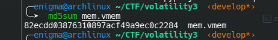
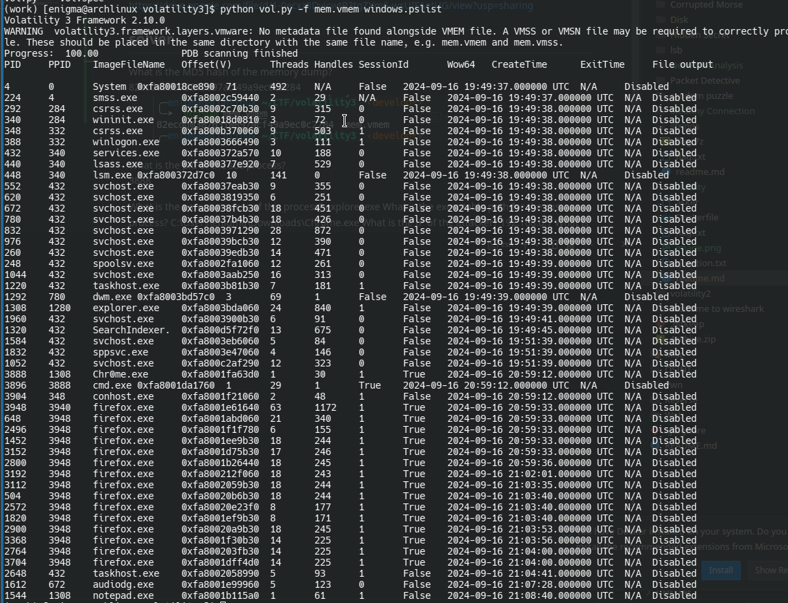
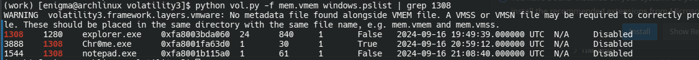
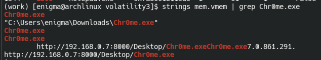
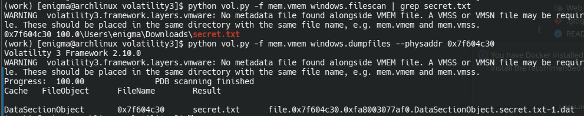

# description
We’ve captured a memory dump from a compromised system, and now it's up to you to uncover the details of the attack! Dive deep into the memory analysis 

# file
https://drive.google.com/file/d/1-0ecxz8DvicwtP3tgZXm6-wsUIFAetUG/view?usp=sharing

## solver

What is the MD5 hash of the memory dump?
<br>
<br>
82ecdd03876310897acf49a9ec0c2284


What is the pid of the sus process?
<br>

<br>
we can find a process Chr0me.exe with a cmd.exe as a child process so the pid of the sus process is
3888

What is the parent process of this process? use grep
<br>

explorer.exe

What is the executable path for the sus process?
<br>
C:\Users\enigma\Downloads\Chr0me.exe

What is the IP of the attacker?
<br>
we can see that the victim download Chr0me.exe from this url http://192.168.0.7:8000/Desktop/Chr0me.exeChr0me.exe so the attacker ip is 
192.168.0.7

What is the content of the secret file?
<br>
we can search for the secret file with this plugin
```
python vol.py -f mem.vmem windows.filescan | grep secret.txt
```
and then dump it

kesa7-rak-ya-moudir
