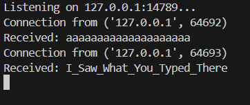

#   Fortnite 2 500 - Malware Analysis Writeup

## Challenge Descritption

For this task, I want you to observe the malware execution and see its behaviour. This malware is the same one as Fortnite task, it just has a slightly different behaviour. You're not supposed to reverse it as it'll ruin the fun, instead setup a simple local server that listens to the specified IP/port number. Flagformat: Securinets{easterEgg_bufferSize} (Note: the easter egg is a special interaction for the malware whenever you type in "securinets") (Malware infos: IP: 127.0.0.1, Port: 14789)

---

## Provided Files

[fortnite_setup.exe](taskFiles/fortnite_setup.exe)

---

## Analysis

This challenge is a continuation of the last one. The player here will have as a goal to focus on the malware behavior, and, in a nutshell, be on the exploiting side of the malware instead of the victim, to get the actual output of the keylogger and observe it in action.

To summarize, you should set up a local server to listen on the provided tcp port, execute the malware, and, just start typing on your keyboard. after typing some characters and reaching the buffer size, you should be able to see the exact keys that you pressed on the server's output. Getting the buffer size now will be as simple as counting the number of chars, and, do not forget the null byte sent along the string. so, it'll be number of chars + 1.

 It was also specified in the description to get the easter egg of this malware, which you should get after typing the sequence securinets.

[server python code](solver/serv.py)

**flag: Securinets{I_Saw_What_You_Typed_There_21}**

