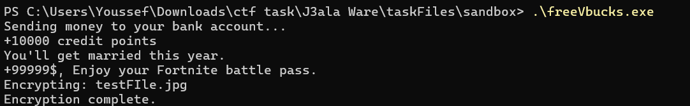
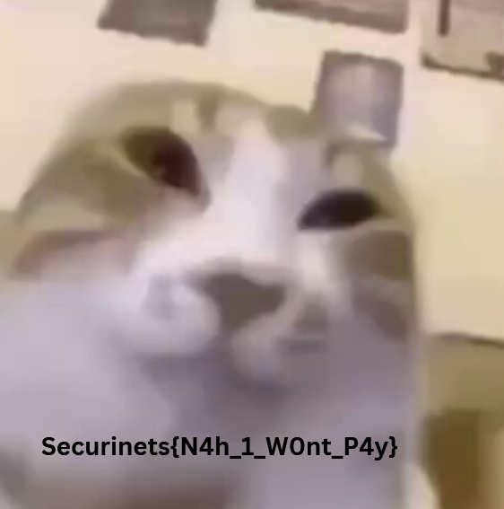

#   J3ala Ware 483 - Malware Analysis Writeup

## Challenge Descritption


God I'm an idiot. This is the third malware I get tricked into executing it. I lost all of my really important documents. Can you please help me get them back? **(Note: Although this is a malware analysis task, this file is totally secure and indeed try executing it. Some antiviruses will maybe flag it as a malware, but, once again, its totally secure to execute it and analyse it.)**

---

## Provided Files

[j3ala.c](taskFiles/j3ala.c)

[victim files](taskFiles/victim_files)

[sandbox](taskFiles/sandbox)

---

## TL;DR

To summarize, this is a ransomware. The victim had his files encrypted and you're tasked to decrypt them. The flag will be in the [Super_Secret.png](taskFiles/victim_files/Super_Secret.png). As you can see, it's a corrupted file, you can read the encryption logic in the [source code](taskFiles/j3ala.c). For now, here's a [solver](solver/decrypt.py).

**Flag: Securinets{N4h_1_W0nt_P4y}**

---

## Initial Analysis

For this challenge, the players were given a zip file. Upon extraction, we're presented with a bunch of files. First, we see the [victim files](taskFiles/victim_files) directory which contains a bunch of corrupted pngs and a [HACKED.txt](taskFiles/victim_files/HACKED.txt) file that says `You're hacked! Send money to securinets Insat or forget about your silly cat files.`

Going over to the [sandbox folder](taskFiles/sandbox), we're presented with the [Malware executable](taskFiles/sandbox/freeVbucks.exe) and a test png file. Executing the malware will corrupt the file and leave a text like in the victim's directory.

We can easily deduce that this is a **rasomware**. A **ransomware** by definition is *a type of malware that permanently blocks access to the victim's personal data unless a "ransom" is paid.*

So now to the main task, which is reading the [source code of the malware](taskFiles/j3ala.c). Reading the functions' names, we can easily deduce that this malware performs some xor encryption based logic.

```c
void xor_encrypt(const char* filename) {
    FILE *file = fopen(filename, "rb+");
    if (!file) {
        perror("Failed to open file for encryption");
        return;
    }

    fseek(file, 0, SEEK_END);
    long filesize = ftell(file);
    rewind(file);

    if (filesize < 2) {
        fclose(file);
        return;
    }

    unsigned char* buffer = (unsigned char*)malloc(filesize);
    if (!buffer) {
        perror("Memory allocation failed");
        fclose(file);
        return;
    }

    fread(buffer, 1, filesize, file);

    for (long i = 0; i < filesize - 1; i++) {
        buffer[i] ^= buffer[i + 1];
    }

    rewind(file);
    fwrite(buffer, 1, filesize, file);
    fclose(file);
    free(buffer);
}
```

It also displays some fake activity as a cover while the malware executes its malicious payload.

```c
void fake_activity() {
    const char* fake_messages[] = {
        "Sending money to your bank account...",
        "+10000 credit points",
        "+99999$, Enjoy your Fortnite battle pass."
    };

    for (int i = 0; i < 4; i++) {
        printf("%s\n", fake_messages[i]);
        Sleep(2000);
    }
}
```


In a nutshell, the xor_encrypt function reads a file, takes each byte and xors it with the next one. According to this logic, only the last byte will remain intact. Decrypting it will be as simple as starting from the last byte and using it to decrypt the one before it and so on.

Say a file with the bytes: `a b c d`. Once encrypted, it'll become `a^b b^c c^d d`.

So, the decrypting logic will be to decrypt the third byte with the d byte, we'll get back the c byte and use it to decrypt the second byte and get back b...

Writing a solver in python following this logic is quite simple

```py
import os

def xor_decrypt(input_filepath, output_filepath):
    try:
        with open(input_filepath, 'rb') as infile:
            filesize = os.path.getsize(input_filepath)
            
            buffer = bytearray(infile.read())

            for i in range(filesize - 2, -1, -1):
                buffer[i] ^= buffer[i + 1]

        with open(output_filepath, 'wb') as outfile:
            outfile.write(buffer)

        print(f"Decryption successful. Output written to {output_filepath}")

    except FileNotFoundError:
        print("Failed to open input file")
    except Exception as e:
        print(f"An error occurred: {e}")

if __name__ == "__main__":
    input_filepath = input("Enter the path of the file to decrypt: ")
    output_filepath = input("Enter the path for the decrypted output file: ")

    xor_decrypt(input_filepath, output_filepath)

```

And now to the final step:

```bash
\ctf task\J3ala Ware> python solver\decrypt.py                                
Enter the path of the file to decrypt: .\taskFiles\victim_files\Super_Secret.png
Enter the path for the decrypted output file: decrypted.png
Decryption successful. Output written to decrypted.png
```



**Flag: Securinets{N4h_1_W0nt_P4y}**

### Note

If you're wondering about this function:

```c
int verify_directory() {
    char cwd[PATH_MAX];
    if (_getcwd(cwd, sizeof(cwd)) != NULL) {
        char* dirname = strrchr(cwd, '\\');
        if (dirname != NULL) {
            dirname++;
            if (strcmp(dirname, "sandbox") == 0) {
                return 1;
            }
        }
    } else {
        perror("Failed to get current working directory");
    }
    return 0;
}
```

**Its purpose is protecting you, the player, in case this malware was executed in a directory other than the sandbox. Please note that you're responsible for your own actions if you decide to remove that function and compile the malware.**