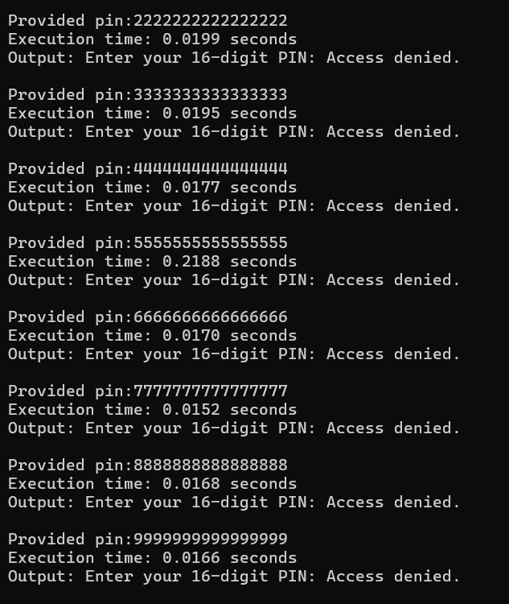
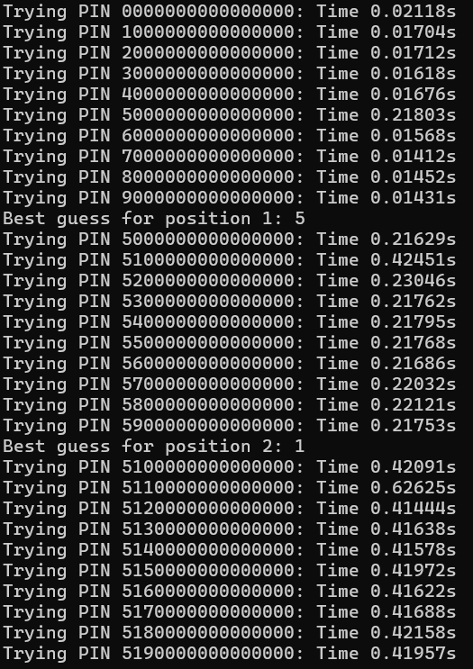
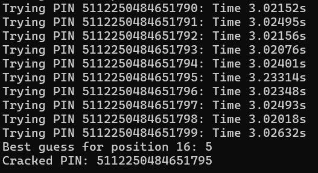

#   Bruteforce Timing  500 - Misc Writeup

## Challenge Descritption


Did you know that it would take about 317 years to brute force a 16 digits pin? (Flag format: Securinets{output of the file_pin}) **Note: This isn't a reverse engineering task!**

Hints:

- Check timing-based side-channel attacks.

- Something about the execution time of checks on some pins is weird. You could tell it takes longer.

- Check out [this article](https://medium.com/spidernitt/introduction-to-timing-attacks-4e1e8c84b32b).

---

## Provided Files

[tryme](taskFiles/tryme)

---

## TL;DR

This pin validator checks pins one by one from left to right. Validating an incorrect pin is much faster then validating the correct one. Here's the [python solver](solver/brute.py). After getting the correct the pin **5112250484651795** and inputing it, a file will called **out** will be created, which, after analysing the header, is a PNG containing the flag.

**Flag: Securinets{T1m1ng_b4sed_brutef0rce_1s_way_f4ster_5112250484651795}**

---

## Initial Analysis

In this challenge, we're provided with only one file. A quick analysis reveals that it's a linux executable.

```bash
└─$ file tryme
tryme: ELF 64-bit LSB pie executable, x86-64, version 1 (SYSV), statically linked, no section header
```

When you execute it, it prompts you for a 16 digit pin and then it validates it.

```bash
└─$ ./tryme
Enter your 16-digit PIN: 1233452929292928
Access denied.
```

The task's description said it's not a reverse engeineering task (although it could be quite possible to get the pin that way) and bruteforcing a 16 digit pin is out of the question. The task's name hints to something related to timing and bruteforce. A quick search into timing based attack would give us some hints to solve this task.

*Timing attacks measure how long a computer takes to perform a certain operation to gain knowledge about the data the system is working on. While there are many factors that can influence processing time, the attacker can take many measurements to determine an average time.*

Well let's make a python script that provides different pins to this program and calculates the execution time for same digits pins

```py
import subprocess
import time

def test_pin(executable_path, input_data):
    start_time = time.time()

    process = subprocess.Popen(executable_path, 
                                stdin=subprocess.PIPE, 
                                stdout=subprocess.PIPE, 
                                stderr=subprocess.PIPE)
    
    output, error = process.communicate(input=input_data.encode())
    end_time = time.time()
    execution_time = end_time - start_time

    print(f"Provided pin:{input_data}")
    print(f"Execution time: {execution_time:.4f} seconds")
    print(f"Output: {output.decode()}")

executable_path = "./tryme"

for i in range(10):
    input_data = str(str(i) * 16)
    test_pin(executable_path, input_data)
```



A quick analysis of the result reveals that **5555555555555555** has a significantly longer execution time with 0.2188 seconds compared to the average of 0.02 seconds of the other pins.

We can now suppose that this pin checker reads every digit from left to right, and breaks whenever it finds an incorrect pin. Not so clear?

Let's suppose this is the pin verification script

```py
def string_compare(s1,s2):
    if len(s1) != len(s2):
        return False
    for i in range(len(s1)):
        if s1[i] != s2[i]:
            return False
    return True
```
There is a flaw in this implementation which most of us don’t realize immediately!

Assuming the required password to be a ten-digit integer, it would take an attacker 10¹⁰ possible combinations to use brute force to find it.

Let us assume that the correct password is 5263987149, and the attacker starts guessing from the first digit (beginning from 0000000000). He measures that the system returns false after x seconds. After getting the same response time x for the first five guesses (i.e., from 0000000000 to 4000000000), he notices that the system takes a slightly longer time to respond ( x + ∆ x) when he tries 5000000000. This is because the for loop during its first iteration doesn’t return false since the first digit of the user input and the stored password is equal. Hence, the loop runs another iteration, thereby taking more time (∆x). Therefore, the attacker knows that the first digit he tried now is correct. He can repeat the same procedure to guess the remaining digits by observing the pattern of ∆x. In this way, it would take the attacker only 10*10 guesses at the maximum to find the correct password, compared to 10¹⁰ possible combinations while trying to brute force it…

Writing a python script to exploit this is quite simple

```py
import time
import subprocess

program = './tryme'
PIN_LENGTH = 16

def try_pin(pin):
    start_time = time.time()
    process = subprocess.Popen([program], stdin=subprocess.PIPE, stdout=subprocess.PIPE, stderr=subprocess.PIPE)
    process.communicate(input=pin.encode())
    end_time = time.time()
    
    return end_time - start_time

def brute_force_pin():
    pin = ['0'] * PIN_LENGTH
    for i in range(PIN_LENGTH):
        timings = {}
        for digit in '0123456789':
            test_pin = ''.join(pin[:i] + [digit] + pin[i + 1:])
            elapsed_time = try_pin(test_pin)
            timings[digit] = elapsed_time
            print(f"Trying PIN {test_pin}: Time {elapsed_time:.5f}s")
        
        best_digit = max(timings, key=timings.get)
        pin[i] = best_digit
        print(f"Best guess for position {i+1}: {best_digit}")
    
    return ''.join(pin)

if __name__ == "__main__":
    cracked_pin = brute_force_pin()
    print(f"Cracked PIN: {cracked_pin}")
```
For each digit in the PIN, it tries all possible digits ('0' to '9') one by one, measuring the time taken by the target program (./tryme) to check the input. The correct digits will make the program run slightly longer before rejecting the PIN, so the script picks the digit with the longest response time as the most likely correct one. This process is repeated for each position in the PIN, gradually building up the correct PIN until all digits are guessed.



Based on this execution, we can say that this pin starts with **512**. After letting the script run for a while, we get back the correct pin.



```bash
└─$ ./tryme
Enter your 16-digit PIN: 5112250484651795
wow it worked! check your files.
```
It works! But where's the flag? Looking into the local directory, a new file called out is created. Running a file command reveals it's a PNG file.

```bash
└─$ file out
out: PNG image data, 530 x 571, 8-bit/color RGBA, non-interlaced
```


**Flag: Securinets{T1m1ng_b4sed_brutef0rce_1s_way_f4ster_5112250484651795}**
