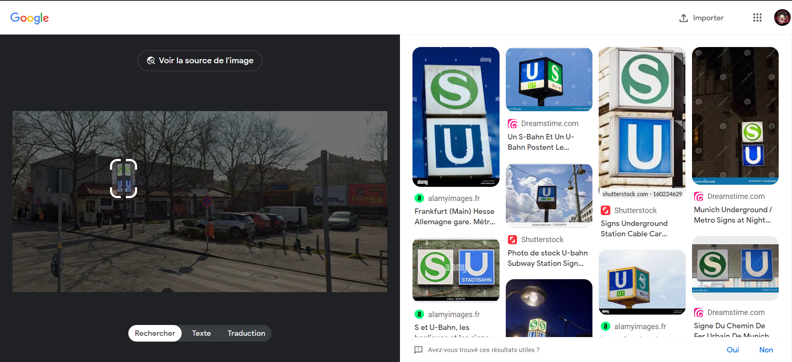

# Description
Where can i find this metro station?

Flag format: Securinets{Station_Name}

***author:Akkinator***

# Attachements
Download attachement: [capital.png](src/capital.png) 

# writeup
At first when we try to reverse search this image we wont be able to find any clues to where this picture was taken.

So we try to crop this image while searching to find anything that could lead us somewhere(we should always aim for advertisements or signs that could give us a brand or a shop name or the language in which the signs are written).

It looks like one of the signs in this picture is for a german subway station called U-bahn and S-bahn so we try to look it up.Since the picture is called capital.png we can figure out that this station is in berlin.
Until we find this picture in wikipedia:

but we already know we are looking for **line:U7** since we can read it in the picture 
So we look for stations in line U7 and we look for every station that has S-bahn(Surface) logo since all of them are already U-bahn(underground)

We can verify everystation withe S+U before it's name in google maps until we find the right station 
 

# Flag
**Flag:** Securinets{Jungfernheide}