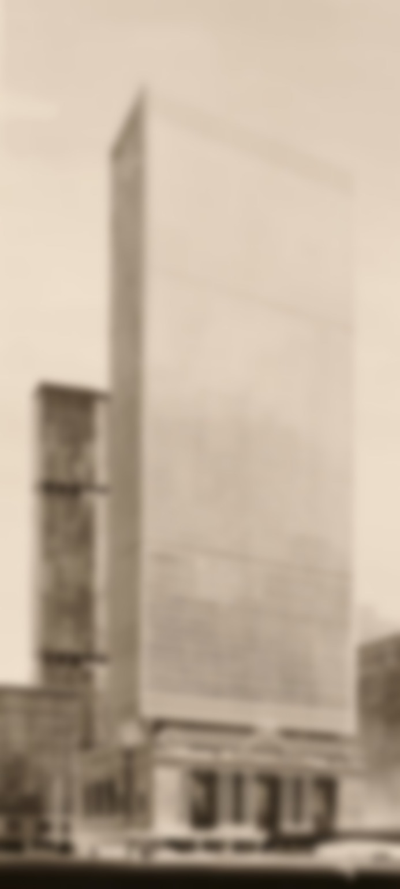
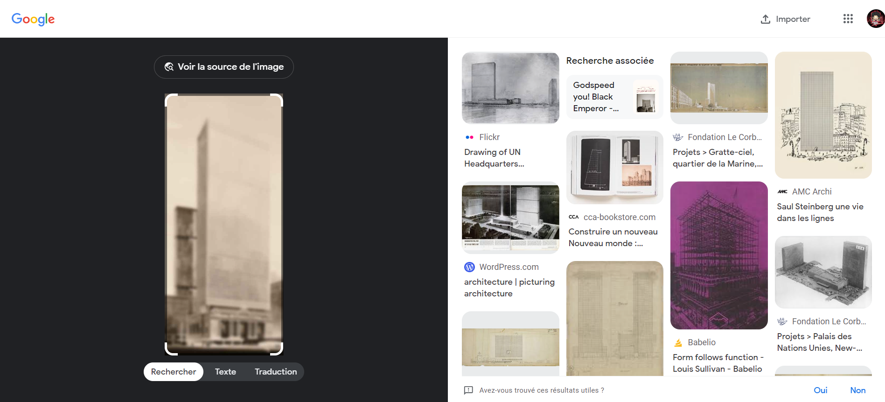
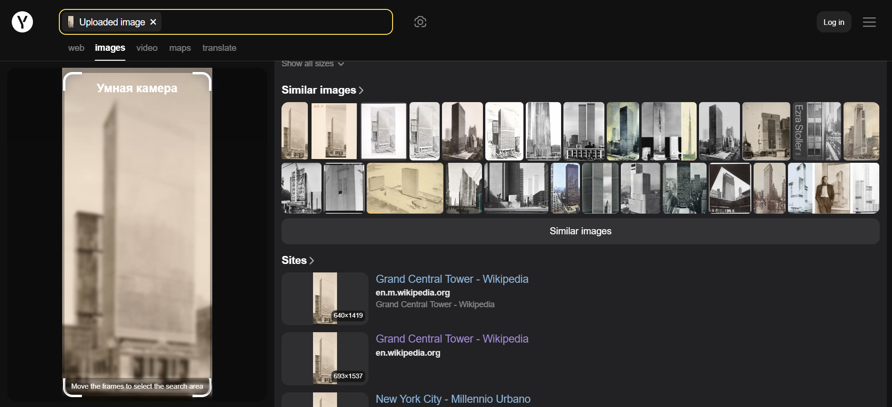
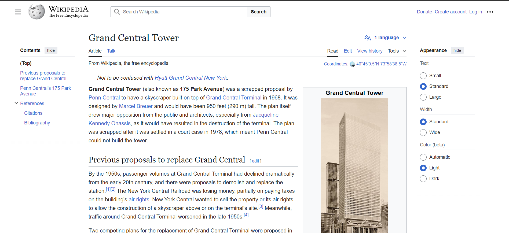
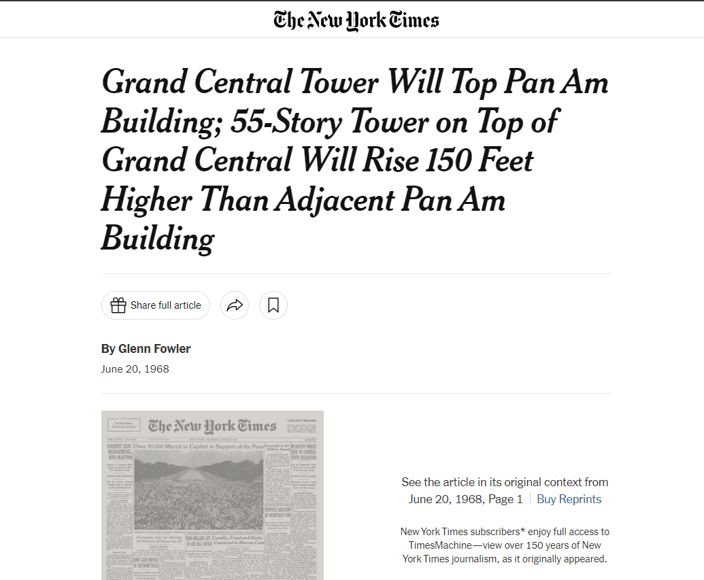

# Description
 In 1968 a murder happened on a roof of a building that could have only been seen from a few  windows in this picture(a nearby building).
Using this information the detective found out the building where the murder happened.
If the building you find has and old and a new name always use the newest name as a flag.

Flag format: Securinets{Building_Name}

***author:Akkinator***

# Attachements
Download attachements: [ML.jpg](src/ML.jpg)

# Writeup
The attachment is what looks like a blurred picture so we try reverse searching it in google lens
This reverse search leads us nowhere so we try another alternative which is Yandex (russian search engine that's better than google lens in reverse searching images)

this leads us directly to this building name "Grand central tower" and it's wiki page 

Looks like a proposal for a building in 1968 that was not done but "it would have been taller tha the Pan Am bilding" which means that u could this the roof of the Pan AM from this building but looking through the wiki page we found that "it would have been very close to the Pan Am building which make it the closest suspect to being the flag since the description says that only people from the grand central tower could see it's roof.So we try looking it up to make sure.

Until we find this artical that from new york times talking about how the grand central tower would have topped the tallest building nearby "Pan Am".
The last step is to look up the "Pan Am Building" current name which is "MetLife building".

# Flag
**Flag**: Securinets{MetLife}
