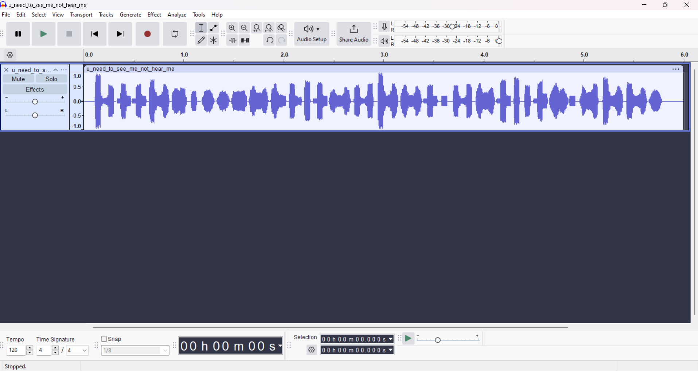
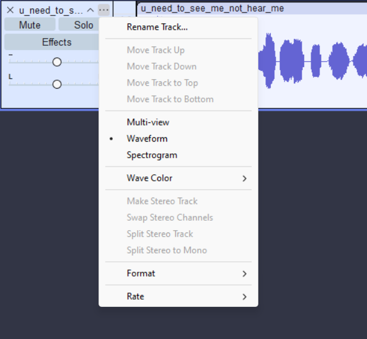
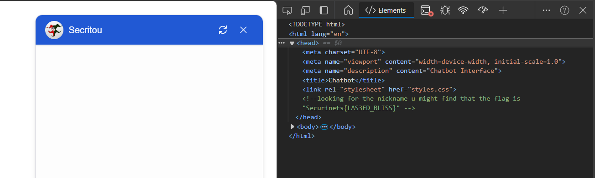

# Description
Looking through the killer's stuff the detective found his bestfriend who after investigation told them one important piece of information about the killer.
But they would have never found his bestfriend without the use of this audio.
(no need to talk to him u need to look at him)

Flag format: Securinets{The_Information}

***author:Akkinator***

# Attachements
download attachements: [u_need_to_see_me_not_hear_me.wav](src/u_need_to_see_me_not_hear_me.wav)

# Writeup
Listening to this audio, it sounds like nothing familiar but the name "u_need_to_see_me_not_hear_me.wav" hints us to look at the soundwaves so we open it in audacity.

Still looks like a normal audio let's try checking the spectogram going to ...>spectogram 

We find what looks like a link to a web page.Where there is bot to chat to next we inspect the web page and we can find the flag in the html script

# Flag
**Flag**: Securinets{LAS3ED_BLISS}
