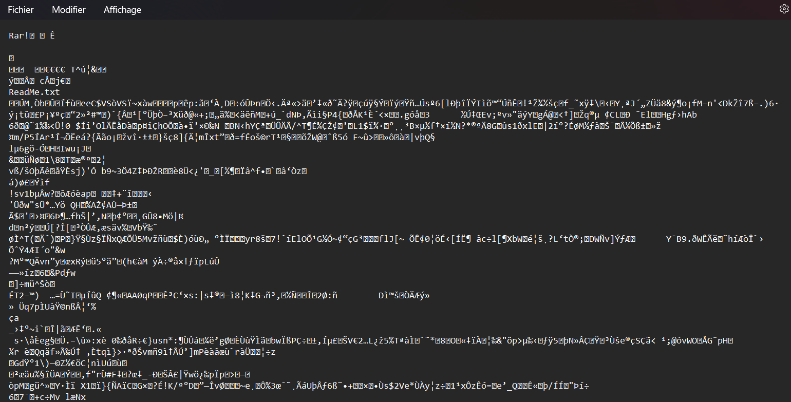
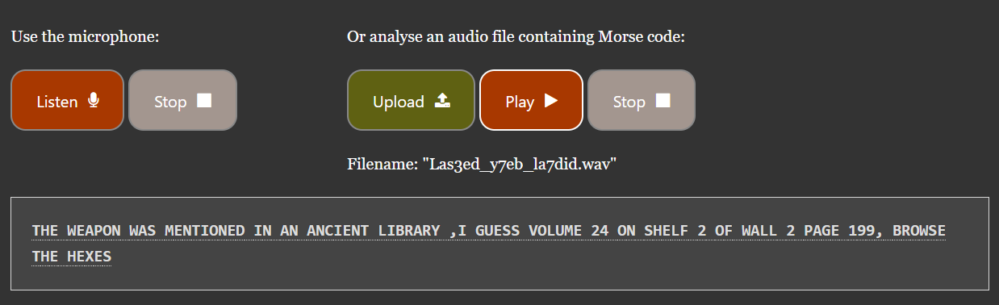
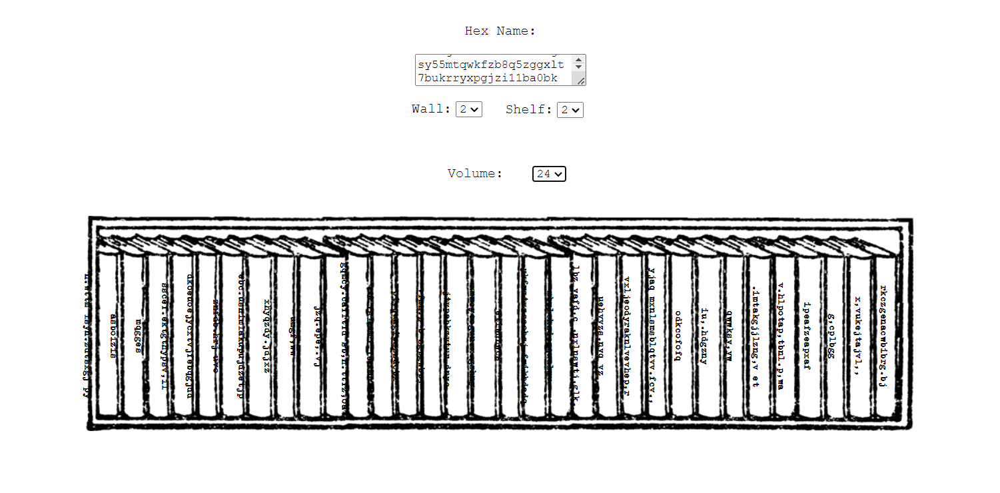
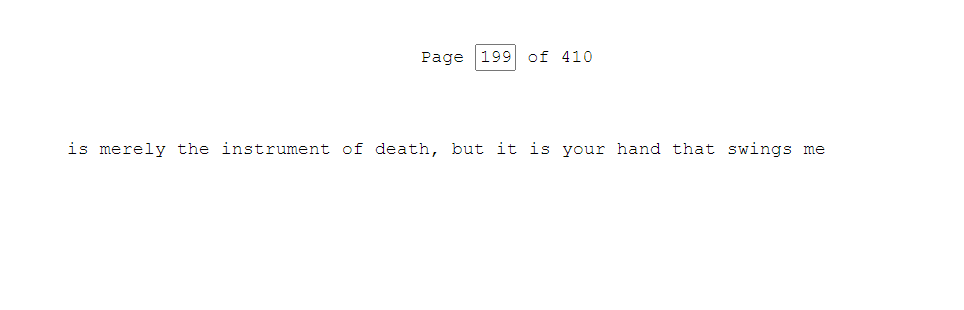
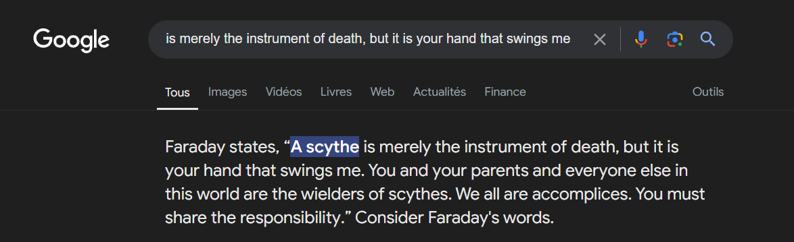

# Description
Looks like the killer left us every detail of the murder alongside the way. So the detective found out the weapon of murder by looking through this file he found in the futuristic device of the killer.

Flag format: Securinets{Weapon_Name}

***author:Akkinator***

# Attachement
Download attachement: [Im_a_rare_file.txt](src/Im_a_rare_file.txt)

# Writeup
The attachement we have is a `.txt` file that we get nothing out of opening it a text:

The "Rar" along with the file name indicates that this is a `.rar` file  so we try renaming the file and extracting it.

We get a `.wav` audio file along with a `.txt` file:
![alt text]src/(image-1.png) 
 
The text file contains a hex text with a title "hex name" and the audio file sounds like a morse code. We use a morse decoder to decode the file.
   

Looking up "Browse the hexes" gets us to website of a library that we can put all the other coordinates:

"Is merely the instrument of death, but it is your hand that swings me" is a description of a weapon but which weapon.

A Scythe it is.

# Flag
**Flag**: Securinets{Scythe}