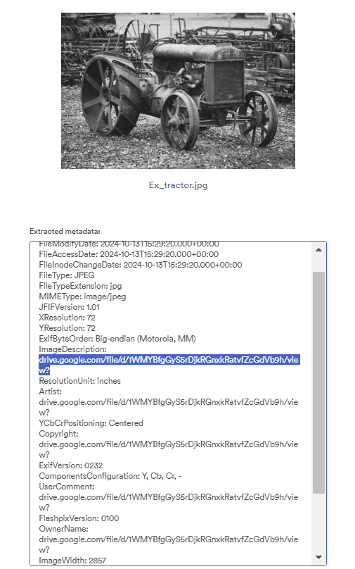
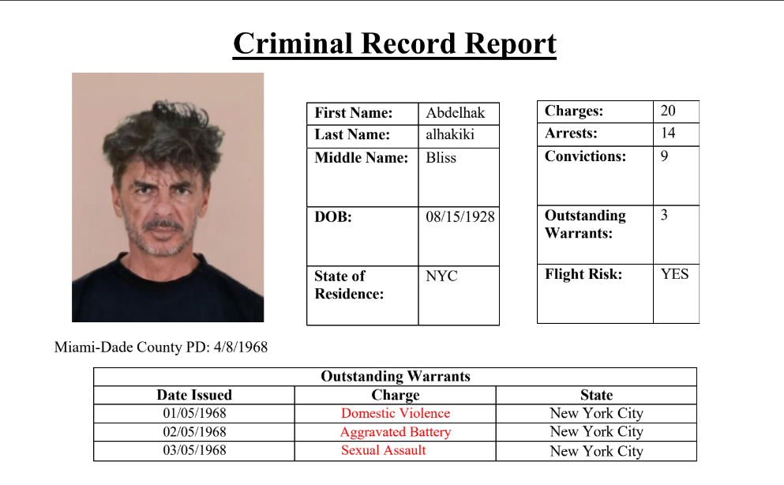

# Description
After a lot of investigation we finally found out that the killer aalready had warrents to his name. The investigation taem were shocked by the first outstanding warrent he had because one of his family members was crying at the murder scene(his ex).

Flag format: Securinets{First_Warrent_Reason}

***author:Akkinator***

# Attachements
Download attachement: [Ex_tractor.jpg](src/Ex_tractor.jpg)

# Writeup
We have `.jpg` file name Ex_tractor which could be a hint to use a metadata extrator as a tool :

Alongside the metatdata we find a link to a google drive file that contains a criminal record: 

We can clearly see now what is the first outstanding warrant.

# Flag
**Flag**: Securinets{Domestic_Violence}
