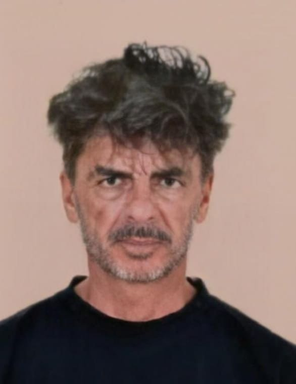

# Description 
Now with everything in hand we need to look at everything we collected to find out the real truth. Everyone that heard what the real truth is, were shocked to discover the identity of the real killer and the real victim.

Flag format: Securinets{The_real_truth}.

***author:Akkinator***

# Attachments
Download attachement: [the_truth.jpeg](src/the_truth.jpeg)

# Writeup
Trying every tool we used in previous tasks doesn't help us discover what this picture really means.
But the analogy used in the description it might be that there's something hidden inside this picture.
So we start trying steganography tools.
The first tool we try is 'steghide' to see if this picture might contain any hidden files. so we open our linux terminal in the directory of the file and we type the command: 

    steghide extract -sf the_truth.jpeg

Looks like we need a password to extract the hidden files inside the picture:

But we don't have any hints about what could be our password except the description of "murder case 0" in which the author indicates that:

1. We should noe down every flag we find from murder case 1 to 4.
2. The killer loves the first letters.
3. The first letters should all be in upper case.
4. The tasks should be solved in the right order

which leads us to:

trying this password we get a new file called "The_real_truth.txt" which means we are on the right path:

Opening this text file we find what looks like a suicide note and in one of the lines it says:
"that makes the real truth is The Killer Is The Victim."
and it looks like we found our flag.
# Flag
**Flag**: Securinets{The_Killer_Is_The_Victim}

