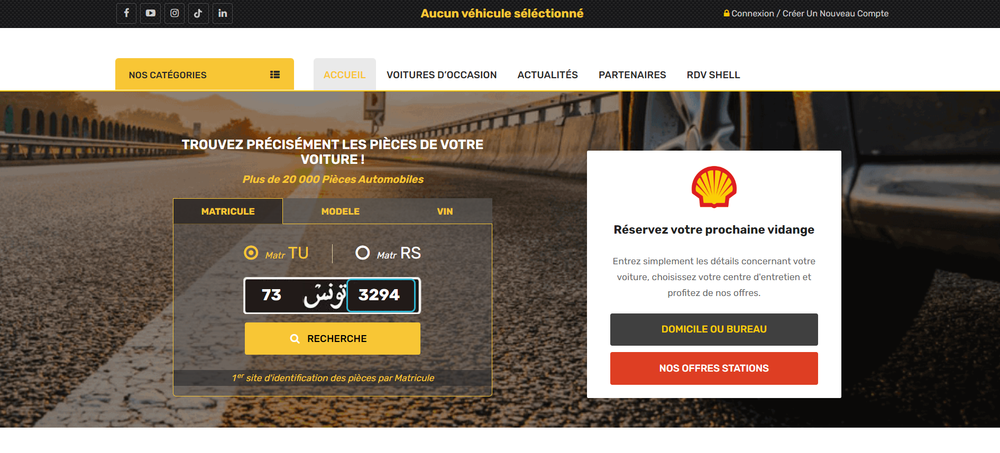
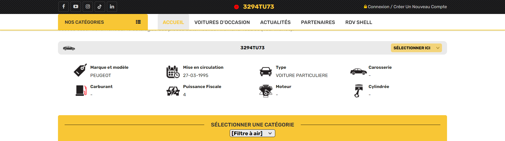

# Description
My car is older than me in the streets.Can u find out when my car first got on the streets ? (write the day, month and year in numbers).
 
Flag format: Securinets{day-month-year}

***author:Akkinator***

# Attachement 
Download attachement: [Moneytalk.jpg](src/Moneytalk.jpg)

# Writeup
Reverse searching this image might misslead us to somewhere where this picture was posted but not the real data about the car but it could assure that this is a tunisian license plate.
So lets try looking up tools that collect data about tunisian license plates.
  

First website we find does actually do the job w just need to write the license plate to extract the needed data:

# Flag 
**Flag**: Securinets{27-03-1995}