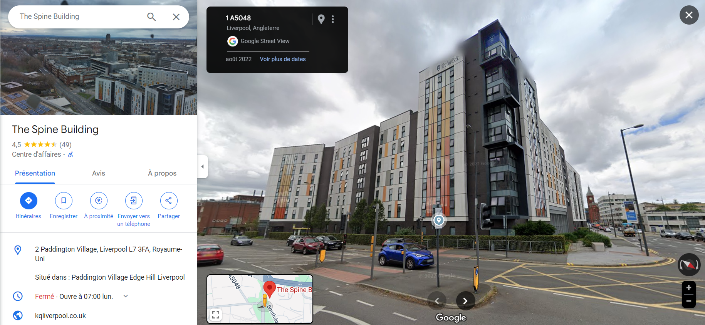

# Description 
Inside a university campus, this picture was taking from a security camera on one of the buildings. what building is this security camera on?and what city is this university in?

Flag format: Securinets{Building_Name_City}

***author:Akkinator***

# Attachements
Download attachement: [University.png](src/University.png)

# Writeup
the first thing we get by reverse searching this image is the name of the glass building:

Now the next step is trying to located the spine building in google maps "The Spine Building" :

we found out the exact place so the webcam should e somewhere on the opposite building:

 

Now the only step left is finding out the building name:

looks like we found "Crown Place Student Accomodation" in the university of liverpool.
# Flag
**Flag**: Securinets{Crown_Place_Liverpool}

